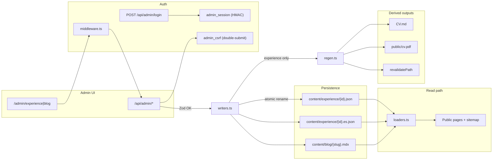

# Design: Admin Backoffice for Content Management

## Technical Approach

Move experience and blog from hardcoded TS to `content/` JSON/MDX files. `src/lib/content/loaders.ts` becomes the single read path for public pages, sitemap, and CV. `/admin` provides CRUD via API routes with signed-cookie auth and CSRF. Writes are **local-dev only** (Vercel FS read-only). On experience mutations, `regen.ts` refreshes `CV.md`, `public/cv.pdf`, and `revalidatePath` targets — non-blocking on regen failure (spec: CV outputs).

## 1. Architecture Overview



**ASCII (write path):**

```
Browser → middleware (session) → Admin form → POST/PUT/DELETE + CSRF
    → API route → Zod → writers.ts (tmp + rename)
        → content/experience/*.json | *.es.json | blog/*.mdx
        → regen.ts (async, non-blocking)
            → CV.md, public/cv.pdf, revalidatePath(/cv, /cv/es, /, /sitemap.xml)
```

**Data ownership**

| Layer | Owner | Notes |
|-------|-------|-------|
| Canonical EN | `content/experience/{id}.json` | Full record; source of truth |
| ES overlay | `content/experience/{id}.es.json` | Delta only: `id`, `role`, `points` |
| Blog | `content/blog/{slug}.mdx` | gray-matter frontmatter + MDX body |
| Derived | `CV.md`, `public/cv.pdf` | Regenerated; not hand-edited |
| Static CV copy | `cvContent.ts` | `CV_STRINGS`, `CV_CONTACT`, skill groups — unchanged by admin |

## 2. Architecture Decisions

| Decision | Alternatives | Choice | Rationale |
|----------|--------------|--------|-----------|
| Prod writes | GitHub Contents API | **Local git workflow** | Sole editor; Vercel FS read-only; simplest MVP (proposal Q1) |
| Auth | Basic `Authorization` header | **Password + signed cookie** | Spec login flow; better UX than per-request Basic |
| Mutations | Server Actions only | **API routes** | Explicit CSRF, JSON errors, testable handlers |
| MDX runtime | `@next/mdx` (compile-time) | **`next-mdx-remote` + `gray-matter`** | Parse edited files from disk without rebuild; blog not public yet |
| Experience order | Filename sort | **`order` integer field** | Spec reorder scenario |
| ES overlay | Full duplicate record | **Delta: `role`, `points` only** | Matches `experienceDataEs.ts`; no `summary` in overlay |
| Regen failure | Block save | **Save succeeds; regen logs warning** | Content files are source of truth (spec error handling) |
| Malformed disk file | Fail build | **Skip entry + `console.error`** | Spec: other pages keep working |

## 3. Data Flow

1. **Read:** `loaders.ts` → `fs.readdir` + parse → Zod → sort by `order` → merge ES overlay when `lang === "es"`.
2. **Write:** API validates session + CSRF → Zod body → `writers.ts` atomic write → `regenAfterExperienceChange()` (fire-and-forget).
3. **Public:** Server components call loaders; `Experience.tsx` receives `entries` prop (spec: client section needs server-fed data).

## 4. File Layout

| Path | Action | Description |
|------|--------|-------------|
| `content/experience/<id>.json` | Create | Canonical EN experience (see §5) |
| `content/experience/<id>.es.json` | Create | ES overlay: `id`, `role`, `points` only |
| `content/blog/<slug>.mdx` | Create | Frontmatter + MDX body |
| `src/lib/content/schemas.ts` | Create | Zod schemas + inferred TS types |
| `src/lib/content/slug.ts` | Create | `idToSlug`, `slugToId`, `slugify` |
| `src/lib/content/loaders.ts` | Create | FS readers, migration fallback chain |
| `src/lib/content/writers.ts` | Create | Atomic writes, uniqueness, cascade delete |
| `src/lib/content/regen.ts` | Create | CV.md render, spawn PDF script, revalidate |
| `src/lib/admin/auth.ts` | Create | Session sign/verify, cookie helpers, logout |
| `src/lib/admin/csrf.ts` | Create | Double-submit token generate/validate |
| `src/middleware.ts` | Create | Guard `/admin/*`, `/api/admin/*`; skip login |
| `src/app/admin/layout.tsx` | Create | Auth guard, `noindex` meta, nav |
| `src/app/admin/login/page.tsx` | Create | Password gate |
| `src/app/admin/page.tsx` | Create | Dashboard links |
| `src/app/admin/experience/page.tsx` | Create | List by `order` |
| `src/app/admin/experience/[id]/page.tsx` | Create | Create/edit + ES section |
| `src/app/admin/blog/page.tsx` | Create | List posts |
| `src/app/admin/blog/[slug]/page.tsx` | Create | Create/edit MDX |
| `src/app/api/admin/login/route.ts` | Create | POST password → set cookie |
| `src/app/api/admin/logout/route.ts` | Create | Clear cookie |
| `src/app/api/admin/experience/route.ts` | Create | POST create |
| `src/app/api/admin/experience/[id]/route.ts` | Create | PUT update, DELETE + `.es.json` |
| `src/app/api/admin/blog/route.ts` | Create | POST create |
| `src/app/api/admin/blog/[slug]/route.ts` | Create | PUT update, DELETE |
| `scripts/regen-cv.ts` | Create | Headless Chrome PDF from `/cv` |
| `scripts/migrate-experience.ts` | Create | One-time TS → JSON seed |
| `src/lib/experienceData.ts` | Delete | After migration |
| `src/lib/experienceDataEs.ts` | Delete | Logic moves to loaders |
| `src/lib/cvContent.ts` | Modify | `getSkillGroups` uses loader data |
| `src/components/sections/Experience.tsx` | Modify | Accept `entries` prop |
| `src/app/page.tsx` | Modify | Pass loader data to Experience |
| `src/app/experience/[id]/page.tsx` | Modify | Import loaders |
| `src/app/sitemap.ts` | Modify | Loader-backed URLs; exclude drafts/admin |
| `package.json` | Modify | Add deps + `regen:cv` script |

## 5. Data Schemas (TypeScript)

```ts
import { z } from "zod";

const EXPERIENCE_ID = /^[0-9]{3}_[A-Z0-9]+$/;
const BLOG_SLUG = /^[a-z0-9]+(?:-[a-z0-9]+)*$/;
const ISO_DATE = /^\d{4}-\d{2}-\d{2}$/;

export const ExperienceFileSchema = z.object({
  id: z.string().regex(EXPERIENCE_ID),
  order: z.number().int().min(1),
  year: z.string().min(1),
  company: z.string().min(1),
  industry: z.string().min(1),
  role: z.string().min(1),
  points: z.array(z.string().min(1)).min(1).max(10),
  stack: z.array(z.string().min(1)).min(1),
  active: z.boolean().optional(),
});
export type ExperienceFile = z.infer<typeof ExperienceFileSchema>;

export const ExperienceEsOverlaySchema = z.object({
  id: z.string().regex(EXPERIENCE_ID),
  role: z.string().min(1),
  points: z.array(z.string().min(1)).min(1).max(10),
});
export type ExperienceEsOverlay = z.infer<typeof ExperienceEsOverlaySchema>;

export const BlogFrontmatterSchema = z.object({
  title: z.string().min(1),
  slug: z.string().regex(BLOG_SLUG),
  date: z.string().regex(ISO_DATE),
  tags: z.array(z.string()).default([]),
  draft: z.boolean(),
  description: z.string().min(1),
});
export type BlogFrontmatter = z.infer<typeof BlogFrontmatterSchema>;
export type BlogMdxFile = BlogFrontmatter & { body: string };
export type ExperienceEntry = ExperienceFile;
```

**Slug rules:** `id` = storage key (`003_VAL`); URL slug = `id.toLowerCase().replace("_", "-")`. Blog `slug` must match `{slug}.mdx`. Reject 409 on collision.

**ES overlay:** only `id`, `role`, `points`. No `summary` — that stays in `cvContent.ts`.

## 6. Auth Flow

| Step | Behavior |
|------|----------|
| Env | `ADMIN_PASSWORD`, `ADMIN_SESSION_SECRET` (≥32 chars) |
| Login | `POST /api/admin/login` → `admin_session` signed cookie |
| Cookie | `{ exp }` + HMAC-SHA256; HttpOnly, SameSite=Lax, Secure in prod, 7-day TTL |
| Middleware | Protect `/admin/*`, `/api/admin/*` except login/logout |
| CSRF | `admin_csrf` cookie + `_csrf` field on mutations |
| Logout | `POST /api/admin/logout` clears cookies |

## 7. Write Atomicity

```ts
async function atomicWriteFile(path: string, content: string) {
  const tmp = `${path}.${process.pid}.tmp`;
  await fs.writeFile(tmp, content, "utf8");
  await fs.rename(tmp, path); // atomic on POSIX
}
```

| Rule | Behavior |
|------|----------|
| Validation fail | 400 + Zod errors; disk untouched |
| EN create/update | `atomicWriteFile` on `{id}.json` |
| ES overlay | Same atomic write; rejected if base EN missing (spec ES overlay) |
| Delete | Remove `{id}.json` + `{id}.es.json` if present |
| Partial save | If ES fails after EN succeeds → 500 + admin warning; EN remains |
| Prod (`VERCEL=1`) | `503 ADMIN_WRITES_DISABLED` before any write |

## 8. CV Regeneration Flow

Triggered on experience create/update/delete only (not blog). Idempotent — safe to re-run.

1. `renderCvMarkdown()` → repo-root `CV.md` (ES: `getExperienceData("es")` + `CV_STRINGS.es`, matches current file shape).
2. `spawn("npx", ["tsx", "scripts/regen-cv.ts"])` — system Chrome `--headless --print-to-pdf=public/cv.pdf` against `http://localhost:3000/cv` (EN PDF).
3. `revalidatePath("/cv")`, `revalidatePath("/cv/es")`, `revalidatePath("/")`, `revalidatePath("/sitemap.xml")`.

**Chrome:** `CHROME_PATH` env or macOS default (`/Applications/Google Chrome.app/...`). No Playwright npm dep. Dev server must be running (open question: self-start vs manual).

**Failure:** Log warning; save still returns 200. Content files are source of truth (spec CV outputs).

## 9. Prod Write Path

**MVP: local-only.** Edit on dev machine → git commit → Vercel build reads `content/` at build time. Future: GitHub Contents API.

## 10. Caching Strategy

`server-only` loaders; `generateStaticParams` for experience; admin `force-dynamic`; `revalidatePath` after writes. No third-party cache.

## 11. Migration Plan

1. Loaders with fallback to `experienceData.ts`
2. Migrate 8 entries to JSON + `.es.json`
3. Switch imports; verify output
4. Delete `experienceData*.ts`
5. Admin + auth + API
6. Wire `regen.ts`

## 12. Error States

| Condition | User sees | Logs |
|-----------|-----------|------|
| Malformed JSON on disk | Entry omitted on public pages | `[content] skip {file}: ZodError` |
| Malformed MDX on disk | Post omitted from admin list | `[content] skip blog/{slug}` |
| Missing ES overlay | EN `role`/`points` on `/cv/es` | — |
| Slug/`id` collision | 409 Conflict | `duplicate id: {id}` |
| Auth fail (no session) | 401 or redirect `/admin/login` | — |
| Wrong password | Generic login error (spec login) | no password logged |
| Missing `ADMIN_PASSWORD` | Config error on login | `ADMIN_PASSWORD unset` |
| Prod read-only FS | "Writes disabled in production" | `ADMIN_WRITES_DISABLED` |
| Chrome not found | Save OK; PDF stale warning | `CHROME_PATH not found` |
| EN saved, ES fail | Partial save warning | `overlay write failed after base` |
| CSRF mismatch | 403 Forbidden | `csrf validation failed` |

## 13. Testing Strategy

Unit: Zod, slugify, atomic writes. Integration: write→read round-trip. Manual: admin CRUD checklist. E2E deferred.

## 14. Dependencies

| Package | Type | Rationale |
|---------|------|-----------|
| `zod` | dep | Schema validation on read/write (spec persistence) |
| `gray-matter` | dep | Parse/serialize MDX frontmatter |
| `next-mdx-remote` | dep | Runtime MDX from disk (vs `@next/mdx` build-time) |
| `server-only` | dep | Prevent FS/auth code in client bundles |
| `tsx` | dev | Run `scripts/regen-cv.ts` and `migrate-experience.ts` |

No Playwright npm — system Chrome via `CHROME_PATH`. Document PATH requirement in README.

## 15. Risks + Mitigations

| Risk | Mitigation |
|------|------------|
| Vercel read-only | Local-only writes |
| Bad JSON | Zod on write; skip on read |
| PDF flaky | Non-blocking regen |
| Client Experience import | Server-fed props |
| Secret leak | server-only auth |

## Open Questions

- [ ] `regen-cv.ts`: require running dev server vs self-start?
- [ ] Public `/blog/[slug]` in this change or follow-up?
- [ ] Vitest vs `node:test`?

**Blockers:** None.
